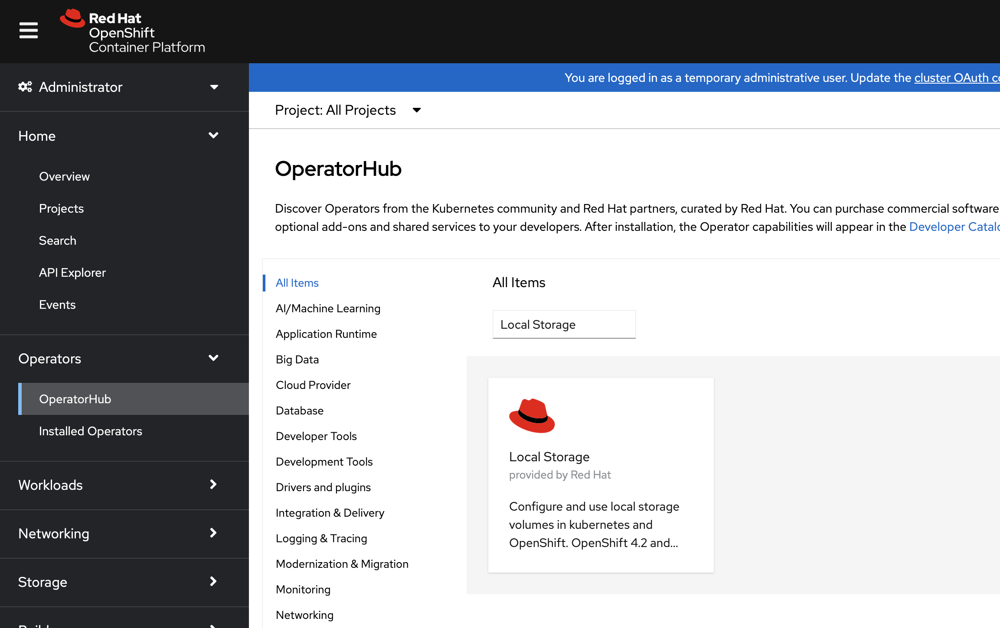
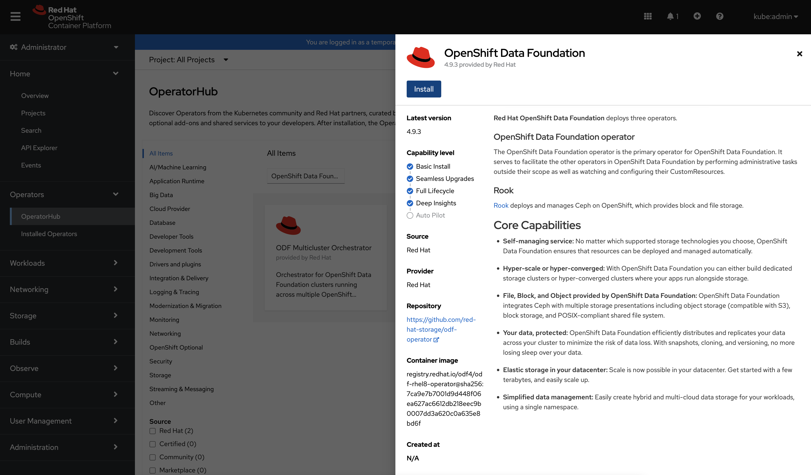
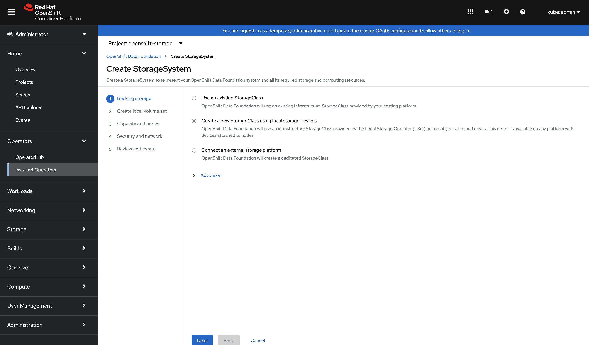
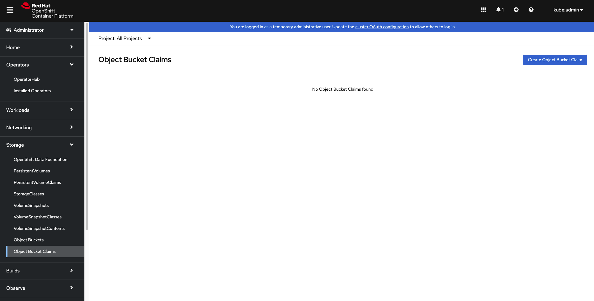
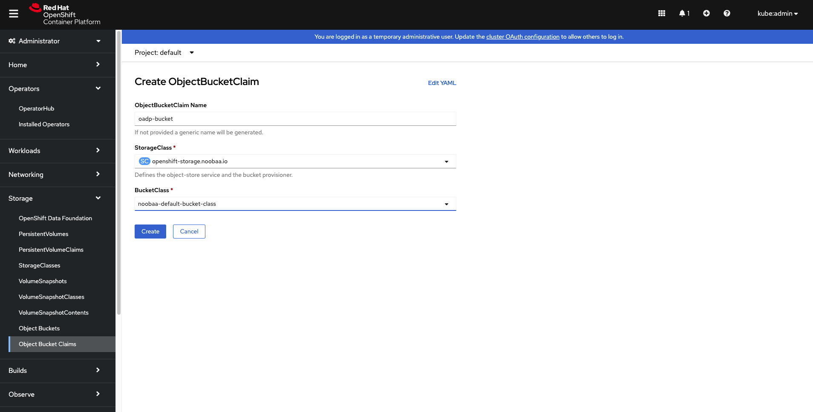
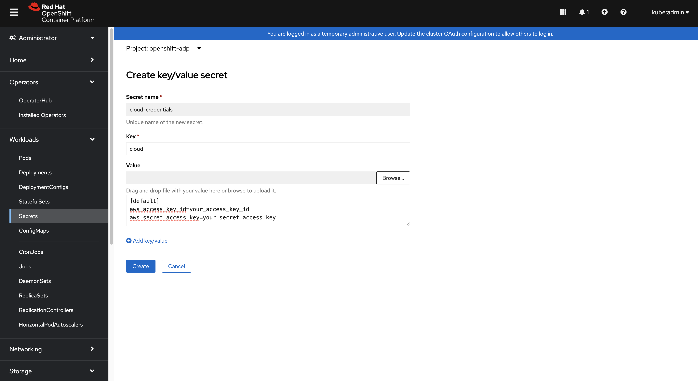

# Guide: Backup and Restore Stateful Applications on OpenShift using OADP and ODF
<!--
We want to publish a blog that contains a guided example of backing up and restoring a CSI-based workload. This should contain:

-   OADP Overview
-   Installation
-   Application Overview
-   Backup/Restore of app showing CSI functionality
-   Upcoming features (Data Mover)
-->

OpenShift API for Data Protection (OADP) enables backup, restore, and disaster recovery of applications on an OpenShift cluster. Data that can be protected with OADP include k8s resource objects, persistent volumes, and internal images.
The OpenShift API for Data Protection (OADP) is designed to protect Application Workloads on a single OpenShift cluster.

Red Hat® OpenShift® Data Foundation is software-defined storage for containers. Engineered as the data and storage services platform for Red Hat OpenShift, Red Hat OpenShift Data Foundation helps teams develop and deploy applications quickly and efficiently across clouds.

In this guide, we will cover:
- Operators installation
  <!-- - Local Storage Operator -->
  - OpenShift Data Foundation
  - OpenShift API for Data Protection Operator
- Application deployment
- Application protection
- A disaster scenario
- Application recovery from disaster
## Pre-requisites
- Terminal environment
  - Your terminal has the following commands
    - [oc](https://access.redhat.com/documentation/en-us/openshift_container_platform/4.9/html/cli_tools/openshift-cli-oc) binary
    - [git](https://git-scm.com/downloads) binary
    - velero
      - Set alias to use command from cluster (preferred)
        - `alias velero='oc -n openshift-adp exec deployment/velero -c velero -it -- ./velero'`
      - [Download velero from Github Release](https://velero.io/docs/v1.8/basic-install/#option-2-github-release)
  - Alternatively enter prepared environment in your terminal with `docker run -it ghcr.io/kaovilai/oadp-cli:v1.0.1 bash`
    - source can be found at https://github.com/kaovilai/oadp-cli
- [Authenticate as Cluster Admin inside your environment](https://access.redhat.com/documentation/en-us/openshift_container_platform/4.9/html/cli_tools/openshift-cli-oc#cli-logging-in_cli-developer-commands) of an OpenShift 4.9 Cluster.
- Your cluster meets the minimum requirement for [OpenShift Data Foundation](https://access.redhat.com/documentation/en-us/red_hat_openshift_data_foundation/4.9/html/planning_your_deployment/infrastructure-requirements_rhodf#minimum-deployment-resource-requirements) in Internal Mode deployment
  - 3 worker nodes, each with at least:
    - 8 logical CPU
    - 24 GiB memory
    - 1+ storage devices

## Installing OpenShift Data Foundation Operator
We will be using OpenShift Data Foundation to simplify application deployment across cloud providers which will be covered in the next section.

1. Open the OpenShift Web Console by navigating to the url below, make sure you are in Administrator view, not Developer.

   ```
   oc get route console -n openshift-console -ojsonpath="{.spec.host}"
   ```
   Authenticate with your credentials if necessary.

<!-- 2. Navigate to *OperatorHub* from the side menu and install **Local Storage Operator**
   
   
   
   Leaving everything as default, click through until the installation finished. -->
2. Navigate to *OperatorHub*, search for and install **OpenShift Data Foundation**

   

### Creating StorageSystem


1. Click *Create StorageSystem* button after it turned blue.
    
<!-- 4. Select *Create a new StorageClass using local storage devices* and click *Next*.
     -->
2. Select *Create a new StorageClass* and follow the *Creating an OpenShift Data Foundation cluster* steps for your cloud provider.
   - [Amazon Web Services(AWS)](https://access.redhat.com/documentation/en-us/red_hat_openshift_data_foundation/4.9/html/deploying_openshift_data_foundation_using_amazon_web_services/deploy-using-dynamic-storage-devices-aws#creating-an-openshift-data-foundation-service_cloud-storage)
   - [Google Cloud (GCP)](https://access.redhat.com/documentation/en-us/red_hat_openshift_data_foundation/4.9/html/deploying_and_managing_openshift_data_foundation_using_google_cloud/deploying_openshift_data_foundation_on_google_cloud#creating-an-openshift-data-foundation-service_gcp)
   - [Microsoft Azure](https://access.redhat.com/documentation/en-us/red_hat_openshift_data_foundation/4.9/html/deploying_openshift_data_foundation_using_microsoft_azure_and_azure_red_hat_openshift/deploying-openshift-data-foundation-on-microsoft-azure_azure#creating-an-openshift-data-foundation-service_azure)
   - [VMware vSphere](https://access.redhat.com/documentation/en-us/red_hat_openshift_data_foundation/4.9/html/deploying_openshift_data_foundation_on_vmware_vsphere/deploy-using-dynamic-storage-devices-vmware#creating-an-openshift-data-foundation-service_cloud-storage)

### Creating Object Bucket Claim
Object Bucket Claim creates a persistent storage bucket for Velero to store backed up kubernetes manifests.

1. Navigate to *Storage* > *Object Bucket CLaim* and click *Create Object Bucket CLaim*
   

2. set the following values:
   - ObjectBucketClaim Name:  `oadp-bucket`
   - StorageClass: `openshift-storage.noobaa.io`
   - BucketClass: `noobaa-default-bucket-class`

   

3. Click *Create*

   
   When the *Status* is *Bound*, the bucket is ready.

4. Click on oadp-secret in the bottom left to view bucket secrets
5. Click Reveal values to see the bucket secret values. Copy data from *AWS_ACCESS_KEY_ID* and *AWS_SECRET_ACCESS_KEY* and save it as we'll need it later when installing the OADP Operator.
## Deploying an application
Since we are using OpenShift Data Foundation, we can use common application definition across cloud providers regardless of available storage class.

Clone our demo apps repository and enter the cloned repository.
```sh
git clone https://github.com/kaovilai/mig-demo-apps --single-branch -b oadp-blog-rocketchat
cd mig-demo-apps
```

Apply rocket chat manifests.
```sh
oc apply -f apps/rocket-chat/manifests/
```

Navigate to rocket-chat setup wizard url obtained by this command into your browser.
```
oc get route rocket-chat -n rocket-chat -ojsonpath="{.spec.host}"
```

Enter your setup information. remember it as we may need it later.

Skip to step 4, select "Keep standalone", and "continue".

Press "Go to your workspace"


"Enter"

Go to Channel #general and type some message


## Installing OpenShift API for Data Protection Operator
You can install the OADP Operator from the Openshift's OperatorHub. 
You can search for the operator using keywords such as `oadp` or `velero`.


Now click on `Install`

<!--  -->

Finally, click on `Install` again. This will create namespace `openshift-adp` 
if it does not exist, and install the OADP operator in it.

<!--  -->

### Create credentials secret for OADP Operator to use
We will now create secret `cloud-credentials` using values obtained from Object Bucket Claim in namespace `openshift-adp`.

From OpenShift Web Console side bar navigate to *Workloads* > *Secrets* and click *Create* > Key/value secret


Fill out the following fields:
- Secret name: `cloud-credentials`
- Value:
  - Replace the values with your own values and enter it in the value field.
      ```
      [default]
      aws_access_key_id=<INSERT_VALUE>
      aws_secret_access_key=<INSERT_VALUE>
      ```
      *Note:* Do not use quotes while putting values in place of INSERT_VALUE Placeholders



<!-- ```
$ oc create secret generic cloud-credentials --namespace openshift-adp --from-file cloud=<CREDENTIALS_FILE_PATH>
``` -->

### Create the DataProtectionApplication Custom Resource

Create an instance of the DataProtectionApplication (DPA) CR by clicking on `Create Instance` as highlighted below:


The Velero instance can be created by selecting configurations using the OCP Web UI or by using a YAML file as mentioned below.

Finally, set the CR spec values appropriately, and click on `Create`.

The CR values are mentioned for ease of use. Please remember to mention `default: true` in backupStorageLocations if you intend on using the default backup storage location as shown below.

```
apiVersion: oadp.openshift.io/v1alpha1
kind: DataProtectionApplication
metadata:
  name: dpa-sample
spec:
  configuration:
    velero:
      defaultPlugins:
      - openshift
      - aws
    restic:
      enable: true
  backupLocations:
    - name: default
      velero:
        provider: aws
        default: true
        objectStorage:
          bucket: my-bucket
          prefix: my-prefix
        config:
          region: us-east-1
          profile: "default"
        credential:
          name: cloud-credentials
          key: cloud
  snapshotLocations:
    - name: default
      velero:
        provider: aws
        config:
          region: us-west-2
          profile: "default"

```


### Verify install

To verify all of the correct resources have been created, the following command
`oc get all -n openshift-adp` should look similar to:

```
NAME                                                     READY   STATUS    RESTARTS   AGE
pod/oadp-operator-controller-manager-67d9494d47-6l8z8    2/2     Running   0          2m8s
pod/oadp-velero-sample-1-aws-registry-5d6968cbdd-d5w9k   1/1     Running   0          95s
pod/restic-9cq4q                                         1/1     Running   0          94s
pod/restic-m4lts                                         1/1     Running   0          94s
pod/restic-pv4kr                                         1/1     Running   0          95s
pod/velero-588db7f655-n842v                              1/1     Running   0          95s

NAME                                                       TYPE        CLUSTER-IP       EXTERNAL-IP   PORT(S)    AGE
service/oadp-operator-controller-manager-metrics-service   ClusterIP   172.30.70.140    <none>        8443/TCP   2m8s
service/oadp-velero-sample-1-aws-registry-svc              ClusterIP   172.30.130.230   <none>        5000/TCP   95s

NAME                    DESIRED   CURRENT   READY   UP-TO-DATE   AVAILABLE   NODE SELECTOR   AGE
daemonset.apps/restic   3         3         3       3            3           <none>          96s

NAME                                                READY   UP-TO-DATE   AVAILABLE   AGE
deployment.apps/oadp-operator-controller-manager    1/1     1            1           2m9s
deployment.apps/oadp-velero-sample-1-aws-registry   1/1     1            1           96s
deployment.apps/velero                              1/1     1            1           96s

NAME                                                           DESIRED   CURRENT   READY   AGE
replicaset.apps/oadp-operator-controller-manager-67d9494d47    1         1         1       2m9s
replicaset.apps/oadp-velero-sample-1-aws-registry-5d6968cbdd   1         1         1       96s
replicaset.apps/velero-588db7f655                              1         1         1       96s
```

## Back up application

## Uhh what? Disasters?

## Restore application

## Conclusion

### Remove workloads from this guide
```sh
oc delete ns openshift-adp rocket-chat openshift-storage
```

If openshift-storage namespace is stuck, follow [troubleshooting guide](https://access.redhat.com/documentation/en-us/red_hat_openshift_data_foundation/4.9/html/troubleshooting_openshift_data_foundation/troubleshooting-and-deleting-remaining-resources-during-uninstall_rhodf).

If you have set velero alias per this guide, you can remove it by running the following command:
```sh
unalias velero
```